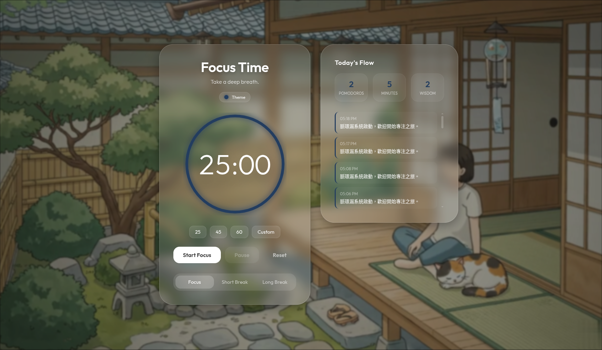

# Mind From Roast | 脈環漏

> 讓心靈從漫長的煎熬中抽離，找回專注與平靜。

「脈環漏」——諧音自閩南語的「別擔心」（mài huân-ló）。這不僅是一個番茄鐘，更是一場關於心靈修復的視覺與感官旅程。



---

## 品牌理念 (Brand Concept)

### 🌿 「Mind From Roast」
代表「讓心靈從這些煎熬中抽離」。在忙碌與煩躁的工作中，我們常感到被「火烤（Roast）」般的焦慮感。這個產品旨在幫助您在每次計時中抽離負面情緒，進入專注的化境。

### 🌀 「脈環漏」的多重意涵
- **脈 (Mài)**：取自「脈輪（Chakra）」，代表能量的中心與內在的流動。
- **環 (Huán)**：代表「環形時鐘（Circular Clock）」，產品核心的 SVG 進度環視覺。
- **漏 (Lòu)**：代表「沙漏感（Hourglass）」，時間緩緩流逝，帶走焦慮，留下智慧。

不論是「脈環漏」還是 Mind From Roast，這三個字合起來，正是閩南語中那句最溫暖的安慰：**「免煩惱（別擔心）」**。

---

## 核心功能 (Core Features)

- **🌀 脈動環儀表**：動態 SVG 進度環，與呼吸頻率同步的發光微動效。
- **⏱️ 背景穩定計時**：採用 Web Worker 技術，確保分頁進入背景或最小化時計時依然精確，不被瀏覽器節流。
- **🔔 系統級通知**：整合 Notifications API，時間結束時即使在其他視窗也能收到提醒（配有輕靈的風鈴聲）。
- **🧠 智慧問答**：每段專注結束後觸發「智慧時刻」，引導您放下當下的執著與擔憂。
- **🎭 多樣化主題**：內建 16 種療癒配色，涵蓋明亮的「明色系」與深度專注的「沉靜深色系」。
- **📜 專注日誌**：使用 `localStorage` 自動紀錄您今日的產出、專注分鐘與智慧瞬間。
- **📱 響應式佈局 (RWD)**：支援桌面與行動端，無論在何處，都能擁有一方專注的淨土。
- **🔁 Ping-Pong 無縫循環**：背景影片經 FFmpeg 加工，實現極致流暢的視覺銜接。

---

## 音訊資源來源
本專案使用的高品質環境音資源如下：
- **White/Pink/Brown Noise**: 透過 Web Audio API 即時運算生成。
- **咖啡店環境音 (Cafe Ambience)**: 源自 [Freesound - air.totem](https://freesound.org/people/air.totem/sounds/745625/) (CC0 1.0 授權)。
- **溫和雨聲 (Gentle Rain)**: 源自 [Orange Free Sounds](https://www.orangefreesounds.com/) (CC BY-NC 4.0 授權)。
- **風鈴聲 (Wind Chime)**: 源自 [Pixabay](https://pixabay.com/sound-effects/film-special-effects-wind-chime-small-64660/) (Pixabay Content License)。

---

## 技術架構 (Technological Stack)

- **核心**：Vanilla JS (ES6+), HTML5, CSS3, Web Workers API
- **設計系統**：Glassmorphism (玻璃擬態), SVG Filter Animation
- **多媒體處理**：FFmpeg (Ping-Pong Loop Filter)
- **資料儲存**：Local Storage API, Notifications API
- **自動化**：GitHub Actions (Gemini AI 每日格言更新)

---

## 目錄結構 (Directory Structure)

```bash
mind-from-roast/
├── assets/
│   ├── audio/      # 療癒音效 (風鈴)
│   ├── video/      # 背景影片 (無縫循環)
│   └── images/     # 項目圖示與 Logo
├── css/            # 樣式表 (Vannila CSS)
├── data/           # 每日格言 JSON (由 AI 自動更新)
├── js/             # 核心邏輯、多語系與 Worker
├── scripts/        # 自動化維護腳本 (Python)
├── index.html      # 入口文件
└── README.md
```

---

## 如何開始 (Quick Start)

1. 開啟 `index.html`。
2. 點擊右上角 **鈴鐺圖示** 開啟系統通知權限 (推薦)。
3. 在頂部 **Theme** 選單選擇您心儀的色系。
4. 點選時間快速球（25/45/60）或自訂分鐘。
5. 點擊 **Start Focus**，開始您的心靈之旅。

---

## 結語

當時間流逝，願您不僅完成工作，更能找到內心的那份「別擔心」。
